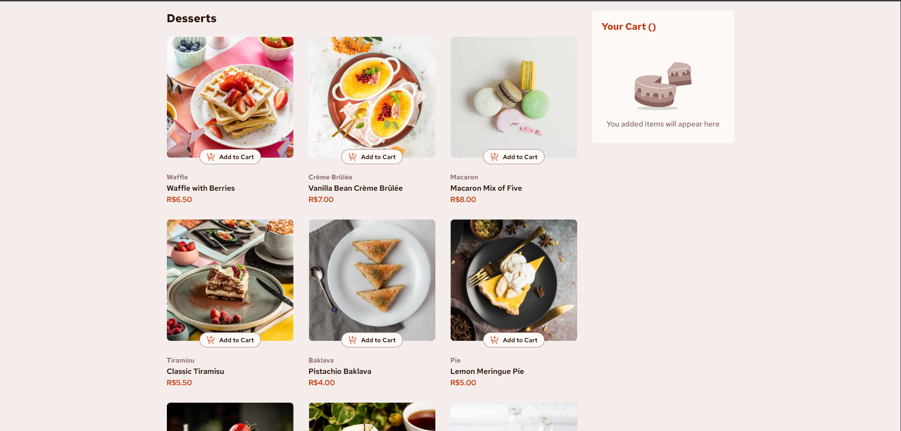

# 🛒 Lista de Produtos com Carrinho | Frontend Mentor Challenge

Esta é uma solução para o [desafio Product list with cart no Frontend Mentor](https://www.frontendmentor.io/challenges/product-list-with-cart-5MmqLVAp_d).

## Índice

- [Visão geral](#visão-geral)
  - [O desafio](#o-desafio)
  - [Screenshot](#screenshot)
  - [Links](#links)
- [Meu processo](#meu-processo)
  - [Construído com](#construído-com)
  - [O que aprendi](#o-que-aprendi)
  - [Desenvolvimento contínuo](#desenvolvimento-contínuo)
- [Autor](#autor)

## Visão geral

### O desafio

Os usuários devem conseguir:

- Adicionar itens ao carrinho e removê-los.
- Aumentar/diminuir a quantidade de itens no carrinho.
- Ver um modal de confirmação do pedido ao clicar em "Confirmar Pedido".
- Resetar as seleções ao clicar em "Novo Pedido".
- Visualizar o layout ideal da interface dependendo do tamanho da tela do dispositivo.
- Ver os estados de hover e foco em todos os elementos interativos da página.

### Screenshot

### Links

- Solução no Frontend Mentor: [Ver solução](https://www.frontendmentor.io/solutions/product-list-with-cart-portuguese-YUEJ6KyeiI)
- Site online (deploy): [Acessar site](https://product-list-with-cart-eosin.vercel.app/)

## Meu processo

### Construído com

- HTML5 semântico
- CSS3 com layout responsivo
- JavaScript (DOM, JSON, lógica de carrinho)

### O que aprendi

Neste projeto, utilizei um arquivo `data.json` para carregar dinamicamente os produtos e reforcei conceitos importantes de manipulação do DOM, como `getAttribute()` Também aprendi a usar a tag `<picture>` para carregar imagens responsivas, melhorando a performance e adaptabilidade do layout.

### Desenvolvimento contínuo

Quero continuar evoluindo no consumo de APIs, aprofundando o uso de `fetch`, `async/await` e técnicas modernas de JavaScript. Além disso, pretendo estudar componentização e frameworks modernos para tornar meus projetos mais escaláveis, organizados e performáticos.

## Autor

- Frontend Mentor - [@jamillyferreira](https://www.frontendmentor.io/profile/jamillyferreira)
- LinkedIn - [@jamillyferreira](https://www.linkedin.com/in/jamillyferreira/)
- GitHub - [jamillyferreira](https://github.com/jamillyferreia)
